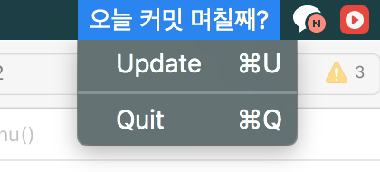
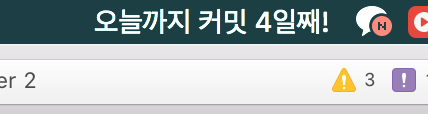

# daily-commit-checker

일일 커밋을 지키고 싶은데, 자극이 필요하여 아주아주 심플하게 만들었습니다.

Xcode에서 프로젝트 불러온 후에, 표시될 글자나 자신의 github 아이디를 AppDelegate.swift의 url에서 바꿔주시면 됩니다.
(기능으로 추가하고 싶었으나 하지 못했습니다.....)

빌드 한 후에 .app파일을 실행하고 앞으로 일일커밋을 달성하시기를 바랍니다. (.app 파일은 build folder 경로에 있습니다. cmd+space로 검색하셔도 됩니다.)

